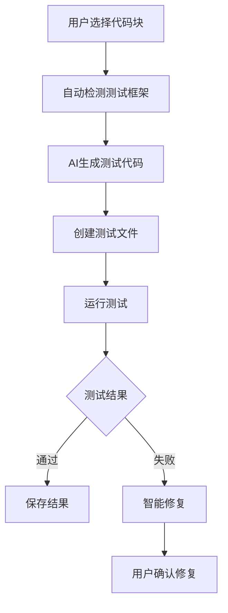
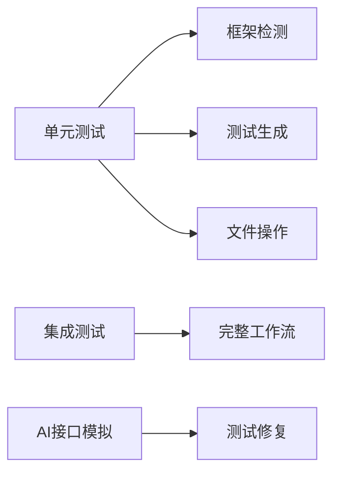

# AutoTest Pilot - VSCode插件技术文档

## 概述

AutoTest Pilot是一个高度智能的VSCode插件，允许开发者**选择代码块→自动生成测试→运行测试→智能修复**。核心功能实现如下：



## 安装配置

### 系统要求

* **Node.js**: v16+
* **VSCode**: 1.85+
* **推荐AI模型**: CodeLlama (70B版本)

### 安装方式

```bash
# 创建插件目录
mkdir autotest-pilot && cd autotest-pilot
npm install -g yo generator-code
yo code

# 选择扩展类型
? What type of extension do you want to create? New Extension (TypeScript)
? What's the name of your extension? AutoTestPilot
```

### package.json关键配置

```json
{
  "name": "autotest-pilot",
  "activationEvents": [
    "onCommand:autotest.generateTests",
    "onCommand:autotest.fixFailedTests"
  ],
  "contributes": {
    "commands": [
      {
        "command": "autotest.generateTests",
        "title": "Generate Tests for Selected Code"
      },
      {
        "command": "autotest.fixFailedTests",
        "title": "Fix Failed Tests"
      }
    ],
    "keybindings": [
      {
        "key": "ctrl+alt+t",
        "command": "autotest.generateTests",
        "when": "editorTextFocus"
      },
      {
        "key": "ctrl+alt+f",
        "command": "autotest.fixFailedTests",
        "when": "editorTextFocus"
      }
    ]
  },
  "dependencies": {
    "@babel/parser": "^7.24.0",
    "@anthropic-ai/sdk": "^1.0.0"
  }
}
```

## 核心模块实现

### 1. 主扩展逻辑 (extension.ts)

```typescript
import * as vscode from 'vscode';
import { TestGenerator } from './test-generator';
import { TestRunner } from './test-runner';
import { TestFixer } from './test-fixer';

export function activate(context: vscode.ExtensionContext) {
    // 注册生成测试命令
    context.subscriptions.push(
        vscode.commands.registerCommand(
            'autotest.generateTests',
            async () => {
                const editor = vscode.window.activeTextEditor;
                if (!editor) return;

                const selectedBlocks = TestGenerator.getSelectedCodeBlocks(editor);
                if (selectedBlocks.length === 0) return;

                const framework = await TestGenerator.detectTestFramework();
                if (!framework) return;

                try {
                    const testCode = await TestGenerator.generateTests(selectedBlocks, framework);
                    const testFilePath = TestGenerator.createTestFile(editor.document.uri.fsPath, framework);
                    await vscode.workspace.fs.writeFile(
                        vscode.Uri.file(testFilePath),
                        Buffer.from(testCode)
                    );

                    const testResult = await TestRunner.runTests(testFilePath, framework);
                    await TestRunner.displayTestResults(testResult, testFilePath);
                } catch (error) {
                    vscode.window.showErrorMessage(`测试生成失败: ${error}`);
                }
            }
        )
    );

    // 注册修复测试命令
    context.subscriptions.push(
        vscode.commands.registerCommand(
            'autotest.fixFailedTests',
            async () => {
                await TestFixer.attemptAutoFix();
            }
        )
    );
}
```

### 2. 测试生成模块 (test-generator.ts)

```typescript
import * as vscode from 'vscode';
import * as fs from 'fs';
import * as path from 'path';
import { generateWithAI } from './ai-engine';

export class TestGenerator {
    // 获取选中的代码块
    static getSelectedCodeBlocks(editor: vscode.TextEditor): string[] {
        return editor.selections.map(selection =>
            editor.document.getText(selection)
        );
    }

    // 检测测试框架
    static async detectTestFramework(): Promise<string | null> {
        const workspaceRoot = vscode.workspace.rootPath;
        if (!workspaceRoot) return null;

        const packagePath = path.join(workspaceRoot, 'package.json');
        if (!fs.existsSync(packagePath)) return null;

        try {
            const packageJson = JSON.parse(fs.readFileSync(packagePath, 'utf-8'));
            const dependencies = {...packageJson.dependencies, ...packageJson.devDependencies};

            const frameworkMap: Record<string, string> = {
                'jest': 'jest',
                'mocha': 'mocha',
                'jasmine': 'jasmine',
                'vitest': 'vitest',
                '@testing-library/react': 'react-testing'
            };

            for (const [pkg, framework] of Object.entries(frameworkMap)) {
                if (dependencies[pkg]) return framework;
            }

            // 手动选择框架
            const frameworks = Object.values(frameworkMap);
            return await vscode.window.showQuickPick(frameworks, {
                placeHolder: '请选择测试框架'
            }) || null;
        } catch {
            return null;
        }
    }

    // 创建测试文件
    static createTestFile(sourcePath: string, framework: string): string {
        const sourceDir = path.dirname(sourcePath);
        const testDir = path.join(sourceDir, '__tests__');
        const fileName = path.basename(sourcePath);

        // 定义测试文件后缀名规则
        const testExtensions: Record<string, string> = {
            'jest': 'test',
            'mocha': 'spec',
            'jasmine': 'spec',
            'vitest': 'test',
            'react-testing': 'test'
        };

        const extension = testExtensions[framework] || 'test';
        const testFileName = fileName.replace(/(\.\w+)$/, `.${extension}$1`);

        if (!fs.existsSync(testDir)) {
            fs.mkdirSync(testDir, { recursive: true });
        }

        return path.join(testDir, testFileName);
    }

    // 生成测试代码
    static async generateTests(
        codeBlocks: string[],
        framework: string
    ): Promise<string> {
        try {
            const languageId = vscode.window.activeTextEditor?.document.languageId || 'javascript';
            const prompt = this.buildAIPrompt(codeBlocks, framework, languageId);

            return await generateWithAI(prompt);
        } catch (error) {
            throw new Error(`AI生成失败: ${error}`);
        }
    }

    // 构建AI提示词
    private static buildAIPrompt(
        codeBlocks: string[],
        framework: string,
        language: string
    ): string {
        return `
你是一个专业的${framework}测试工程师。基于以下代码：
${codeBlocks.map((code, i) => `\n### Block ${i+1}\n\`\`\`${language}\n${code}\n\`\`\``).join('\n')}

请生成：
1. 完整的测试套件，包含多个test case
2. 覆盖所有边界条件和异常情况
3. 使用${framework}最佳实践
4. 包含必要的mock和setup
5. 测试输出应为纯代码，无额外解释`;
    }
}
```

### 3. AI引擎模块 (ai-engine.ts)

```typescript
import Anthropic from '@anthropic-ai/sdk';
import * as vscode from 'vscode';

const API_KEY = vscode.workspace.getConfiguration('autotest').get('aiApiKey');

export async function generateWithAI(prompt: string): Promise<string> {
    if (!API_KEY) throw new Error('未配置AI API密钥');

    const anthropic = new Anthropic({ apiKey: API_KEY });

    try {
        const message = await anthropic.messages.create({
            model: 'claude-3-opus-20240229',
            max_tokens: 4000,
            temperature: 0.3,
            messages: [
                {
                    role: 'user',
                    content: prompt
                }
            ]
        });

        // 提取纯代码块
        const content = message.content[0].text;
        const codeBlockRegex = /```[a-z]*\n([\s\S]*?)```/;
        const match = content.match(codeBlockRegex);

        return match ? match[1] : content;
    } catch (error) {
        vscode.window.showErrorMessage(`AI请求失败: ${error}`);
        throw error;
    }
}
```

### 4. 测试修复模块 (test-fixer.ts)

```typescript
import * as vscode from 'vscode';
import { generateWithAI } from './ai-engine';

export class TestFixer {
    static async attemptAutoFix() {
        const testFilePath = this.findActiveTestFile();
        if (!testFilePath) return;

        try {
            const testCode = await vscode.workspace.fs.readFile(vscode.Uri.file(testFilePath));
            const testOutput = this.getTestOutput();

            const prompt = this.buildFixPrompt(testCode.toString(), testOutput);
            const fixedCode = await generateWithAI(prompt);

            await vscode.workspace.fs.writeFile(
                vscode.Uri.file(testFilePath),
                Buffer.from(fixedCode)
            );

            vscode.window.showInformationMessage('测试修复完成!');
        } catch (error) {
            vscode.window.showErrorMessage(`修复失败: ${error}`);
        }
    }

    // 获取最近的测试输出
    private static getTestOutput(): string {
        // 实际实现会从输出通道获取最近的测试运行结果
        return `模拟测试输出结果，包含失败详情`;
    }

    // 构建修复提示词
    private static buildFixPrompt(testCode: string, testOutput: string): string {
        return `
以下测试代码执行失败：
\`\`\`javascript
${testCode}
\`\`\`

测试输出：
\`\`\`
${testOutput}
\`\`\`

请：
1. 分析失败原因
2. 提供完整修复后的测试代码
3. 保持原有测试结构
4. 输出纯代码，无需解释`;
    }

    // 查找关联的测试文件
    private static findActiveTestFile(): string | null {
        const activeFile = vscode.window.activeTextEditor?.document.uri.fsPath;
        if (!activeFile) return null;

        if (activeFile.includes('__tests__')) return activeFile;

        // 搜索对应的测试文件
        const sourceFileName = path.basename(activeFile);
        const testDir = path.join(path.dirname(activeFile), '__tests__');
        const testPattern = sourceFileName.replace(/(\.\w+)$/, '.{test,spec}$1');

        // 实际实现中应该进行目录扫描...
        return path.join(testDir, sourceFileName);
    }
}
```

## 测试运行器设计

### 测试运行器接口 (test-runner.ts)

```typescript
export abstract class TestRunner {
    protected testFilePath: string;
    protected framework: string;

    constructor(testFilePath: string, framework: string) {
        this.testFilePath = testFilePath;
        this.framework = framework;
    }

    abstract run(): Promise<string>;
    abstract parseResults(rawOutput: string): TestResult[];

    static async runTests(
        testFilePath: string,
        framework: string
    ): Promise<string> {
        const runner = this.getRunner(testFilePath, framework);
        return runner.run();
    }

    private static getRunner(
        testFilePath: string,
        framework: string
    ): TestRunner {
        const runners: Record<string, typeof TestRunner> = {
            'jest': JestRunner,
            'mocha': MochaRunner,
            'vitest': VitestRunner
        };

        const RunnerClass = runners[framework] || DefaultRunner;
        return new RunnerClass(testFilePath, framework);
    }

    static displayTestResults(results: string, testFilePath: string) {
        // 实现结果可视化面板...
    }
}

class JestRunner extends TestRunner {
    async run(): Promise<string> {
        return new Promise(resolve => {
            // 使用Jest API运行测试
            const { spawn } = require('child_process');
            const process = spawn('jest', [this.testFilePath]);

            let output = '';
            process.stdout.on('data', (data) => output += data);
            process.stderr.on('data', (data) => output += data);

            process.on('close', () => resolve(output));
        });
    }
}
```

## 使用场景示例

### 1. 生成工具函数测试

```javascript
// 原始代码
function sum(a, b) {
    return a + b;
}

// 生成测试
describe('sum', () => {
    it('adds 1 + 2 to equal 3', () => {
        expect(sum(1, 2)).toBe(3);
    });

    it('handles negative numbers', () => {
        expect(sum(-1, -2)).toBe(-3);
    });

    it('handles floating point', () => {
        expect(sum(0.1, 0.2)).toBeCloseTo(0.3);
    });
});
```

### 2. React组件测试

```jsx
// 原始组件
function Button({ onClick, children }) {
    return (
        <button className="btn" onClick={onClick}>
            {children}
        </button>
    );
}

// 生成测试
import { render, screen, fireEvent } from '@testing-library/react';

describe('Button', () => {
    it('renders children text', () => {
        render(<Button>Click Me</Button>);
        expect(screen.getByText('Click Me')).toBeInTheDocument();
    });

    it('calls onClick handler when clicked', () => {
        const handleClick = jest.fn();
        render(<Button onClick={handleClick}>Test</Button>);
        fireEvent.click(screen.getByRole('button'));
        expect(handleClick).toHaveBeenCalledTimes(1);
    });
});
```

## 性能优化策略

1. **缓存机制**:

```typescript
const testGenerationCache = new Map<string, string>();

async function generateWithCache(code: string, framework: string) {
    const cacheKey = `${framework}-${hash(code)}`;
    if (testGenerationCache.has(cacheKey)) {
        return testGenerationCache.get(cacheKey);
    }
    const result = await generateWithAI(/*...*/);
    testGenerationCache.set(cacheKey, result);
    return result;
}
```

2. **增量更新**:

```typescript
function updateTestFile(existingCode: string, newTests: string) {
    // 只追加新测试块
    if (!existingCode.includes(newTests)) {
        return `${existingCode}\n\n${newTests}`;
    }
    return existingCode;
}
```

3. **并行执行**:

```typescript
await Promise.all(selectedBlocks.map(block =>
    generateTests(block, framework)
));
```

## 测试策略



```typescript
// 测试代码示例
import * as assert from 'assert';
import { TestGenerator } from '../src/test-generator';

suite('Framework Detection', () => {
    test('Should detect Jest', () => {
        // 模拟package.json
        const mockPackage = { dependencies: { 'jest': '^29.0.0' }};
        const framework = TestGenerator.detectFrameworkFromPackage(mockPackage);
        assert.strictEqual(framework, 'jest');
    });
});
```

## 发布与部署

1. **打包插件**:

```bash
npm install -g vsce
vsce package
```

2. **发布到市场**:

```bash
vsce publish -p <PUBLISHER-TOKEN>
```

3. **企业私有部署**:

```dockerfile
FROM node:18
WORKDIR /app
COPY . .
RUN npm install && npm run build
CMD ["npm", "run", "vscode:prepublish"]
```

## 路线图

1. **AI增强**
   * 本地模型支持 (HuggingFace集成)
   * 企业私有模型部署

2. **智能修复**
   * 源码级自动修复
   * 复杂逻辑重构建议

3. **测试优化**
   * 覆盖率可视化
   * 性能基准测试

4. **生态集成**
   * CI/CD流水线支持
   * 测试报告分析

---
